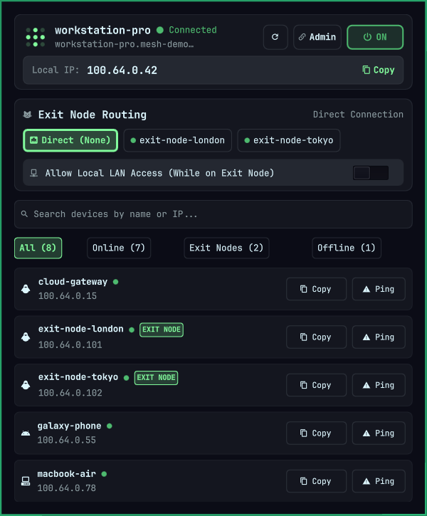

# OmaScale for Omarchy

A native Omarchy status bar widget and interactive network control panel for Tailscale. Replaces basic on/off toggles with full routing management, exit node selection, peer discovery, latency pinging, and telemetry.

<p align="center">
  
</p>

---

## Features

- 🌐 **Exit Node Management:** View active exit node routing, switch instantly between any exit nodes advertised on your tailnet, or revert to a Direct connection with a single click.
- 🏠 **Local LAN Access Toggle:** Easily toggle `--exit-node-allow-lan-access` right from the control panel while routing through an exit node.
- 📋 **1-Click IPv4 Copying:** Instant clipboard copying for your local Tailscale IP or any peer device across the mesh network using native clipboard integration and `wl-copy`.
- ⚡ **Live Latency & Route Probing:** Ping any peer on demand (`tailscale ping --c 1 <ip>`) to view actual roundtrip latency (ms) and determine whether traffic is flowing over a direct connection or relayed via a DERP node.
- 🔍 **Search & Instant Filters:** Quick-search peers by hostname or IP address, or filter devices by All, Online, Exit Nodes, and Offline.
- 🛡️ **Zero-Privilege Security Model:** Runs entirely unprivileged without requiring elevated administrator permissions or root daemons. Does not disrupt or drop internet connections during polling or background checks.

---

## Dependencies & Requirements

- **Omarchy Linux** (Quickshell compositor shell)
- **Tailscale CLI** (`/usr/bin/tailscale`)
- **Python 3.10+** (standard library only; no pip dependencies)
- **`wl-copy`** (`/usr/bin/wl-copy`, default in Omarchy)

---

## Installation

### Via Omarchy Marketplace / CLI (Recommended)

```bash
omarchy plugin add https://github.com/CJKaufman/omarchy-omascale --enable
```

### Manual Git Installation

```bash
git clone https://github.com/CJKaufman/omarchy-omascale \
  ~/.config/omarchy/plugins/cjkaufman.omascale

omarchy plugin enable cjkaufman.omascale
omarchy-restart-shell
```

---

## Removal

To disable and remove the plugin:

```bash
omarchy plugin disable cjkaufman.omascale
omarchy plugin remove cjkaufman.omascale --yes
omarchy-restart-shell
```

---

## Security Model & Hardening

OmaScale is built from the ground up to comply with the Omarchy Plugin Marketplace security guidelines:

1. **Trusted Absolute Binaries:**
   - System utilities (`/usr/bin/tailscale`, `/usr/bin/wl-copy`, `/usr/bin/notify-send`) are pinned to verified absolute locations.
   - Every binary candidate is verified: regular file, non-world-writable (`mode & 0o002 == 0`), owned by root or the current user, and executable.
   - Zero ambient `$PATH` lookups.

2. **Bounded Subprocess Execution:**
   - Uses `run_cmd_bounded()` with select-based non-blocking reads and strict timeouts (4.0s).
   - Maximum output buffer capped at 256KB to prevent memory exhaustion.
   - Explicit child process termination and reaping (`proc.kill()`, `proc.wait()`) on timeout.
   - Never uses shell string interpolation (`shell=False` throughout).

3. **Owned No-Follow State Storage:**
   - Traversal from `~` to `~/.local/state/omarchy/cjkaufman.omascale` validates `0o700` permissions, current user ownership, and strictly rejects symlinks.
   - State writes use atomic temporary file descriptors with `O_WRONLY | O_CREAT | O_EXCL | O_NOFOLLOW | O_CLOEXEC` at mode `0o600`.
   - Explicit `os.fsync()` prior to atomic `os.replace()`.

4. **Input Sanitization:**
   - All CLI parameters (exit node hostnames, peer IPs, boolean flags) are validated against strict regex allowlists before passing to the Tailscale CLI.

---

## Settings

Configurable via Omarchy shell settings or `~/.config/omarchy/shell.json`:

| Setting Key | Type | Default | Description |
| :--- | :--- | :--- | :--- |
| `refreshIntervalSec` | `integer` | `10` | Frequency in seconds for background status polling (5 to 300). |
| `showIpOnBar` | `boolean` | `false` | Displays local Tailscale IPv4 directly on the status bar. |

---

## License

MIT License. Copyright (c) 2026 Carl Kaufman.
